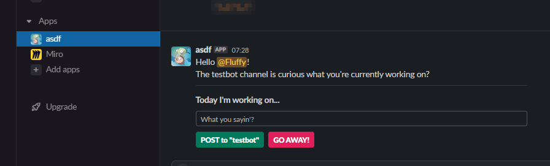

# FluffBott : An annoying questioning bot

This app was born out of the desire to spark conversations in my companies Slack channels regarding Azure work. The basic idea is that it will message everyone in a channel and ask what they're working on, which is then posted on a channel for people to see in hopes that someone doing something might be of interest to someone else. The app connects via web *socket mode*, which keeps the connection to the API alive in the background, negating the need to pass secure tokens to/from users.

Our Azure channel contains global users, but our main employee base is UK, and I only wanted to test this out on EMEA/UK. We have another channel just for EMEA, and thus the idea was to find all people that are listed in channel *Azure* which are only part of of channel *EMEA* and message them.

| Azure Channel | EMEA Channel | People to Spam |
|:------------- | ------------ | -------------- |
| User1         | User1        | User1          |
| User2         | User2        | User2          |
| User3         | User3        | User3          |
| User4         | User4        | User4          |
| User5         | User5        | User5          |
| User6         |              |                |
| User7         |              |                |
| User8         | User8        | User8          |
| User9         |              |                |

This app is called via Slacks Workflow Builder where it will ask you which channel you want to annoy (People to Spam), and which channel of people you want to include (EMEA Channel). Unfortunately my free version of Premium has expired, so I cannot show the screenshot which sets most of this up. The app has bee designed to take inputs from the calls past back to it, process the information to the appropriate channel from those inputs and POST as required. This way, the app can be called multiple times by many different channels without being stuck to one channel.


The app can then be called by the shortcut `/asdf` in the channel, or by selecting the `+` icon.


Each person will receive a notification from the app.



Where people will see the update in the appropriate channel.


...and update the message it sent to you


...or if you told it to go away, it will update the same view with.


## Install Requirements

I found the easiest way to test this out was to build my own Docker container and install the required software, mounting my drives where needed.

#### Create Docker container for testing app

```bash
docker run \
    --name app \
    --cap-add NET_ADMIN \
    --detach \
    --net host \
    --restart unless-stopped \
    -it \
    -v '/mnt/d/OneDrive/GitHub-me':/root/scrapbook \
    ubuntu:20.04
```


#### Install software requirements

```bash
apt-get update
apt-get install -y \
    python3 \
    python3-pip

pip3 install slack_bolt
```


#### Export tokens for use in app

These tokens were needed in order to allow the app to connect to Slack.

```bash
export SLACK_BOT_TOKEN="asdf"
export SLACK_APP_TOKEN="asdf"
```


#### Test Dockerfile once created image

Once I was satisfied with the app and what software was required, I could then create a [Dockerfile](Dockerfile) and run it in the background. The Dockerfile will then be pushed to Azure Container Instance (or wherever) to await annoyances.

```bash
docker run \
    --detach \
    --name asdf \
    --net host \
    -e SLACK_APP_TOKEN='asdf' \
    -e SLACK_BOT_TOKEN='asdf' \
    asdf
```


## Handy Links
- https://api.slack.com/bolt
- https://api.slack.com/apps
- https://app.slack.com/block-kit-builder/
- https://slack.dev/bolt-python/tutorial/getting-started
    - https://api.slack.com/apps/{appId}/oauth?
    - https://api.slack.com/apps/{appId}/event-subscriptions?


## Bot Token Scopes
*Scopes that govern what your app can access.*

`channels:history`
View messages and other content in public channels that ASDFbot has been added to

`channels:read`
View basic information about public channels in a workspace

`chat:write`
Send messages as @asdf

`groups:history`
View messages and other content in private channels that ASDFbot has been added to

`im:history`
View messages and other content in direct messages that ASDFbot has been added to

`mpim:history`
View messages and other content in group direct messages that ASDFbot has been added to

`users:read`
View people in a workspace

`workflow.steps:execute`
Add steps that people can use in Workflow Builder

---

## Subscribe to bot events
*Apps can subscribe to receive events the bot user has access to (like new messages in a channel). If you add an event here, we’ll add the necessary OAuth scope for you.*

`message.channels`
A message was posted to a channel
Required scope: `channels:history`

`message.groups`
A message was posted to a private channel
Required scope: `groups:history`

`message.im`
A message was posted in a direct message channel
Required scope: `im:history`

`workflow_step_execute`
A workflow step supported by your app should execute
Required scope: `workflow.steps:execute`